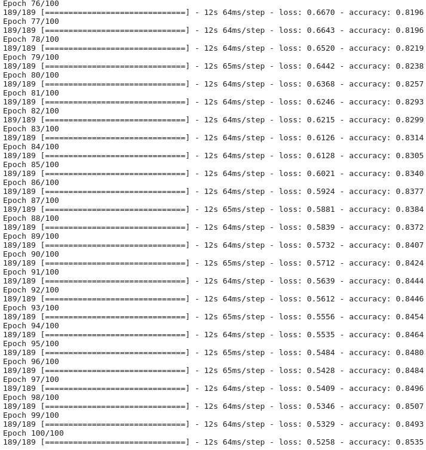

# Image to Caption Generator

## Image to Caption Generator Using Python and Deep Learning

### [Flicker8k-Dataset](https://www.kaggle.com/srbhshinde/flickr8k-sau)

# Model Working

# Model Architecture

# Model Training Logs

# Results

# Future Improvements

- Increase the capacity of the model
- There is a huge space for training maybe 200 epochs can help us to reach more than 95 percent accuracy
- The Image Model is not giving the perfect sequence a few times, needs few more LSTM layers
- The Overall Hardware requirement is increasing now, and need more expensive, maybe Resnet is not a good option, or the repeat vector is not doing the expected job

# Few More Methods

- A object detection algorithm can be used for labeling and the sequence model can be continued after that
- YOLO/SSD/Faster-RCNN can give more small details about the objects present in the image
- For that, a custom dataset preparation is required

